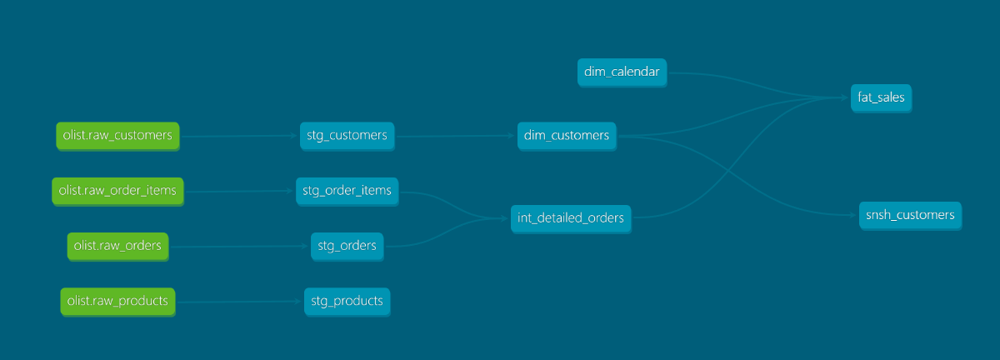

# 🛒 Olist E-commerce Analytics Pipeline (dbt + BigQuery)

Este projeto demonstra a construção de um Modern Data Stack (MDS) completo, transformando dados brutos do e-commerce brasileiro (Olist) em uma estrutura de **Star Schema** pronta para Business Intelligence.

O objetivo principal foi aplicar as melhores práticas de engenharia de dados, saindo de um modelo relacional transacional para um modelo analítico robusto.

---

## 🏗️ Arquitetura do Projeto

A solução foi estruturada seguindo o padrão de camadas (Medallion Architecture adaptada para dbt):

1.  **Staging (`stg_`)**: Limpeza técnica, renomeação de colunas para o padrão de negócio, tipagem de dados (CAST de strings para DATETIME) e tratamento de nulos (`COALESCE`).
2.  **Intermediate (`int_`)**: Camada de lógica de negócio complexa. Aqui realizei a consolidação de itens por pedido e o cálculo de métricas de performance, como o SLA de entrega.
3.  **Marts (`dim_`, `fat_`)**: Modelagem Dimensional (Star Schema). Tabelas otimizadas para consumo em ferramentas de BI como Looker ou Power BI.

---

## 🛠️ Tecnologias e Conceitos Aplicados

* **dbt Core**: Orquestração e transformação dos dados.
* **Google BigQuery**: Data Warehouse escalável.
* **Star Schema**: Criação de tabelas Fato (`fct_vendas`) e Dimensões (`dim_customers`, `dim_calendario`).
* **Governança de Dados**: Implementação de testes de integridade (`unique`, `not_null`, `relationships`) e documentação via arquivos `.yml`.
* **Materialização Estratégica**: 
    * **Views**: Utilizadas em Staging e Intermediate para economia de custos e agilidade.
    * **Tables**: Utilizadas na camada de Marts para garantir performance ao usuário final.

---

## 📊 Lineage Graph (Linhagem de Dados)

> **[]**

A linhagem demonstra o fluxo desde a extração dos dados brutos (Sources) até a entrega da Tabela Fato consolidada.

---

## 🧪 Qualidade e Testes

Foram implementados testes automatizados para garantir a confiabilidade dos dados:
* **Integridade Referencial**: Garantia de que cada item de venda possui um pedido e produto correspondente.
* **Regras de Negócio**: Validação de status de pedidos e garantia de valores monetários não-negativos.

---

## 🚀 Como Executar

1. Clone o repositório.
2. Configure seu `profiles.yml` com as credenciais do BigQuery (Service Account).
3. Execute as transformações:
   ```bash
   dbt run